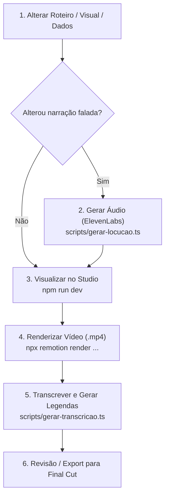

# 🎬 Guia de Produção de Vídeos — Remotion

Este documento descreve o fluxo de trabalho ponta a ponta para criar, alterar, revisar e exportar vídeos neste projeto.

---

## 🔁 Ciclo de Vida de uma Alteração



---

## Passo a Passo Detalhado

### Passo 1: Fazer as alterações no código
- **Texto da fala:** edite `src/UltimosTurnos/roteiro.ts`.
- **Textos e animações visuais da tela:** edite os arquivos em `src/UltimosTurnos/cenas/Cena*.tsx`.
- **Dados da tabela:** edite `src/UltimosTurnos/dados.ts`.

---

### Passo 2: Regerar a locução (se o roteiro mudou)
Quando houver qualquer alteração no texto falado (`narracao` no `roteiro.ts`), execute:

```bash
# Regera todas as cenas
node --env-file=.env --strip-types scripts/gerar-locucao.ts --forcar
```

> **Regerar apenas uma cena:** Apague o arquivo correspondente em `public/voiceover/UltimosTurnos/cena-0X.mp3` e execute sem a flag `--forcar`:
> ```bash
> node --env-file=.env --strip-types scripts/gerar-locucao.ts
> ```

---

### Passo 3: Conferência no Remotion Studio
Abra o estúdio interativo para validar os visuais, sincronia e elementos de tela:

```bash
npm run dev
```
Acesse `http://localhost:3000` no navegador.

---

### Passo 4: Renderizar o vídeo (.mp4)
Gere o arquivo final dentro de `out/Renders/` seguindo o padrão `aaaa_mm_dd_render_vx.mp4`:

```bash
npx remotion render UltimosTurnos out/Renders/2026_08_25_render_v8.mp4
```

Se precisar gerar prints de validação (stills), salve dentro de `out/Revs/rev<N>/`:
```bash
npx remotion still UltimosTurnos out/Revs/rev8/f1250.png --frame=1250
```

---

### Passo 5: Transcrição e Legendas (.srt / .txt)
Gere os arquivos de legenda e revisão a partir do vídeo exportado:

```bash
node --env-file=.env --strip-types scripts/gerar-transcricao.ts out/Renders/2026_08_25_render_v8.mp4
```

Os arquivos resultantes estarão em `out/transcrição/`:
- `out/transcrição/2026_08_25_render_v8.srt` (Legendas)
- `out/transcrição/2026_08_25_render_v8.txt` (Transcrição corrida)
